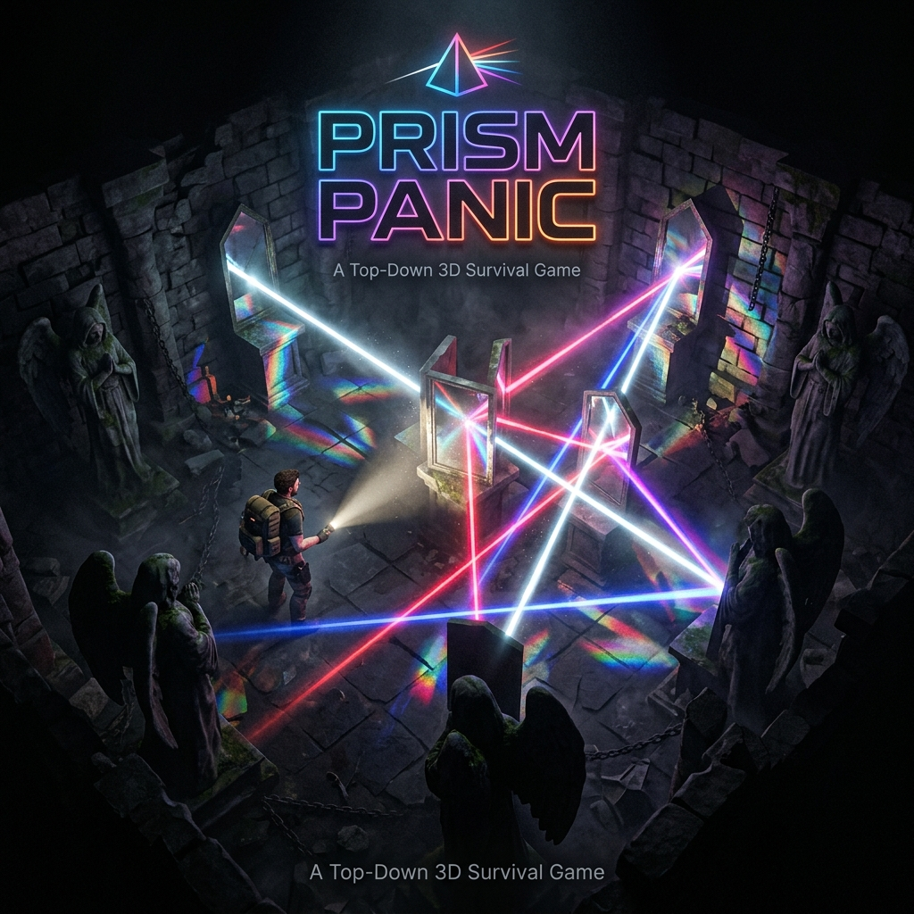

<p align="center">
  
</p>

<h1 align="center">🔦 Prism Panic</h1>

<p align="center">
  <strong>An incremental survival-action game built with Unity 6 — where light is your only weapon.</strong>
</p>

<p align="center">
  
  
  
  
  
</p>

<p align="center">
  <a href="#-game-overview">Overview</a> •
  <a href="#-gameplay-mechanics">Mechanics</a> •
  <a href="#-architecture">Architecture</a> •
  <a href="#-tech-stack">Tech Stack</a> •
  <a href="#-project-structure">Structure</a> •
  <a href="#-getting-started">Setup</a> •
  <a href="#-team">Team</a>
</p>

---

## 🎮 Game Overview

**Prism Panic** is a top-down 3D incremental survival-action game built for a **44-hour Game Jam**. You're trapped in a shifting room with relentless **Angel** enemies — stone beings inspired by Weeping Angels that freeze when illuminated but pursue you the moment they're in shadow.

Your only defense? A **flashlight** that casts beams of light. Direct light merely stuns. But bounce that beam off **mirrors** and it transforms into a deadly weapon — the more reflections, the more devastating the damage.

> 🪞 **Core Fantasy:** Survive by mastering the geometry of light. Angle mirrors, chain reflections, and obliterate Angels with prismatic devastation.

### ✨ Key Features

- 🔦 **Beam Reflection System** — Raycast-based light that bounces off mirrors with real-time physics
- 👼 **Weeping Angel AI** — Enemies freeze under illumination, pursue in darkness via NavMesh
- 🚪 **Roguelite Progression** — Choose from 3 upgrade doors after each cleared room
- 🏠 **Single-Scene Architecture** — One room, infinitely reconfigured with handcrafted layouts
- 💀 **Boss Fight** — A climactic encounter with unique mechanics and a dynamic health bar
- 🎯 **Adrenaline System** — Screen-space heartbeat effects and camera shake as danger approaches
- 🎵 **Dynamic Audio** — Contextual SFX and music that responds to gameplay events

---

## ⚔️ Gameplay Mechanics

### 🔦 The Flashlight — Beam Tiers

The flashlight is your lifeline. Direct beams only stun, but each mirror bounce amplifies the beam's power:

| Tier | Bounces | Color | Effect |
|:---:|:---:|:---:|:---|
| **Basic** | 0 (direct) | ⬜ White | Stun only — 3 sec base duration |
| **Tier 1** | 1 mirror | 🟦 Blue | Base damage (1 hit) |
| **Tier 2** | 2 mirrors | 🟥 Red | 2× damage (2 hits) |
| **Tier 3** | 3+ mirrors | 🟪 Purple | 3× damage (3 hits) |

- Beams **terminate** on walls and pillars
- Beams **reflect** off mirrors (up to 10 bounces tracked)
- The flashlight uses an **energy system** — overuse causes overheating and forced cooldown

### 👼 The Angels

Relentless enemies inspired by the Weeping Angels:

- **Freeze** when illuminated by the flashlight beam
- **Pursue** the player relentlessly when in shadow (NavMesh pathfinding)
- Contact deals **1 damage** — the player has **3 HP** with brief invincibility frames
- Angels **tint from white to red** based on remaining HP
- **Base Stats:** 1.5 units/sec speed · 2 HP · 3 sec stun duration

### 🚪 Upgrade Doors

After clearing all Angels, **3 upgrade doors** appear:

| Upgrade | Effect |
|:---|:---|
| 🛡️ Stun Duration+ | +1 second stun duration |
| 🏃 Move Speed+ | +0.5 units/sec player speed |
| 🔦 Flashlight Cone+ | Widens flashlight cone angle |
| 🪞 Extra Mirror | +1 placeable mirror for next level |
| 📏 Beam Range+ | Extends max beam travel distance |

Walk through a door to receive its upgrade — no menus, pure flow.

### 💀 Boss Fight

Level 8 features a unique **Boss encounter** with:
- Dedicated boss room configuration
- Dynamic mirror mechanics
- Boss health bar UI
- Escalating difficulty phases

---

## 🏗️ Architecture

Prism Panic follows a **clean, event-driven architecture** designed for rapid Game Jam development while maintaining code quality.

### System Flow

```
GameManager (Phase Controller)
    │
    ├── Boot → RoomSetup → CombatPhase → DoorsOpen → UpgradeSelected ─┐
    │                                                                   │
    │   ┌───────────────────────────────────────────────────────────────┘
    │   └── RoomSetup → CombatPhase → ... (loop)
    │
    └── PlayerDeath → GameOver → Restart
```

### EventBus Pattern

All cross-system communication uses a **static EventBus** — no direct method calls between systems:

```
BeamCaster → OnBeamHit → BeamHitHandler → OnAngelKilled → GameManager
                                                              │
                                                    OnAllAngelsCleared
                                                              │
                                              DoorManager → OnUpgradeSelected
                                                              │
                                              UpgradeApplier + LevelManager
                                                              │
                                                     OnRoomReconfigure
                                                              │
                                                     RoomConfigurator
```

### Key Design Decisions

| Decision | Rationale |
|:---|:---|
| **Single Scene** | No loading screens — room reconfiguration via object pooling |
| **ScriptableObject-Driven** | All game data (levels, upgrades, enemies) defined as assets |
| **Object Pooling** | Zero runtime allocations for beams, enemies, mirrors, doors |
| **Event-Driven** | Decoupled systems that can be developed independently |
| **NavMesh AI** | Reliable pathfinding for Angel pursuit behavior |

---

## 🛠️ Tech Stack

| Technology | Usage |
|:---|:---|
| **Unity 6** | Game Engine |
| **Universal Render Pipeline (URP)** | Rendering — 2D lighting, post-processing |
| **C# (.NET Standard 2.1)** | Programming language |
| **Unity Input System** | Cross-platform input handling (KB/M + Gamepad) |
| **NavMesh** | Enemy AI pathfinding |
| **URP Volume System** | Post-processing effects (Adrenaline, Vignette) |
| **Physics 3D** | Raycasting for beam system, collision detection |

---

## 📁 Project Structure

```
Assets/
└── _Game/
    ├── Scripts/
    │   ├── Core/                # GameManager, LevelManager, EventBus, Constants
    │   ├── Player/              # PlayerController, FlashlightController, DangerDetector
    │   ├── Enemies/             # AngelController, BossController
    │   ├── Light/               # BeamCaster, BeamSegment, MirrorReflector, BeamHitHandler
    │   ├── Room/                # RoomConfigurator, WallAppearance
    │   ├── Doors/               # DoorManager, UpgradeDoor
    │   ├── Upgrades/            # UpgradeRegistry, UpgradeApplier
    │   ├── BOSS/                # BossRoomManager, DynamicMirrorController
    │   ├── UI/                  # HUD, GameOver, Victory, Health, Energy, Adrenaline
    │   ├── Audio/               # AudioManager, AudioEffectHandler
    │   ├── ScriptableObjects/   # SO definitions + authored data assets
    │   └── Utilities/           # ObjectPool, PoolManager, Billboard, SpriteAnimator
    ├── Art/                     # Sprites, materials, audio assets
    └── Input/                   # Input action mappings
```

### Script Breakdown

| System | Scripts | Responsibility |
|:---|:---|:---|
| **Core** | `GameManager`, `EventBus`, `LevelManager`, `Constants`, `CameraController` | Game state, events, level flow, camera |
| **Player** | `PlayerController`, `FlashlightController`, `DangerDetector` | Movement, aiming, beam activation, proximity detection |
| **Light** | `BeamCaster`, `BeamSegment`, `BeamHitHandler`, `MirrorReflector`, `AngelIlluminationRegistry` | Raycast beam system, reflection, damage/stun |
| **Enemies** | `AngelController`, `BossController` | AI state machine, pursuit, boss mechanics |
| **Room** | `RoomConfigurator`, `WallAppearance` | Level layout loading, environment setup |
| **Doors** | `DoorManager`, `UpgradeDoor` | Post-clear upgrade selection |
| **Upgrades** | `UpgradeRegistry`, `UpgradeApplier` | Upgrade pool management, stat modification |
| **Boss** | `BossRoomManager`, `DynamicMirrorController` | Boss encounter logic, rotating mirrors |
| **UI** | `HUDController`, `GameOverUI`, `VictoryUI`, `PlayerHealthUI`, `EnergyUI`, `AdrenalineController`, `BossHealthBarUI` | All HUD and screen-space UI |
| **Audio** | `AudioManager`, `AudioEffectHandler` | Sound playback, contextual effects |
| **Utilities** | `ObjectPool`, `PoolManager`, `Billboard`, `DirectionalSprite`, `SimpleSpriteAnimator` | Generic systems and visual helpers |

---

## 🎮 Controls

| Action | Keyboard / Mouse | Gamepad |
|:---|:---|:---|
| **Move** | `WASD` | Left Stick |
| **Aim** | Mouse Position | Right Stick |
| **Flashlight** | Left Mouse (Hold) | Right Trigger (Hold) |
| **Place Mirror** | Right Mouse Click | Right Shoulder |
| **Confirm Placement** | Left Mouse Click | A Button |

---

## 🚀 Getting Started

### Prerequisites

- **Unity 6** (Unity Hub recommended)
- **Universal Render Pipeline** (included in project)
- Git

### Installation

1. **Clone the repository:**
   ```bash
   git clone https://github.com/uKmaz/PrismPanic.git
   ```

2. **Open in Unity Hub:**
   - Click `Open` → navigate to the cloned directory
   - Unity will auto-resolve URP and Input System packages

3. **Open the Main Scene:**
   ```
   Assets/_Game/Scenes/Main.unity
   ```

4. **Press Play** ▶️ — start surviving!

### Build

```
File → Build Settings → Add Open Scenes → Build
```

> **Note:** The game uses a single-scene architecture. Only `Main.unity` needs to be in the build.

---

## 📐 Design Philosophy

<table>
<tr>
<td width="33%" align="center">
<h3>🪞 Reflection is Everything</h3>
<p>Mirrors and light beams are the solution to every problem in the game.</p>
</td>
<td width="33%" align="center">
<h3>😰 Tension Through Pursuit</h3>
<p>Angels never rush, but they never stop. Constant, creeping pressure.</p>
</td>
<td width="33%" align="center">
<h3>✂️ Scope is a Feature</h3>
<p>One room, tight systems, high polish over breadth.</p>
</td>
</tr>
</table>

---

## 🔄 Game Loop

```
┌─────────────────────────────────────────────────────┐
│                                                     │
│   Enter Reconfigured Room                           │
│        ↓                                            │
│   Survive Angel Pursuit                             │
│        ↓                                            │
│   Use Mirrors to Kill All Angels                    │
│        ↓                                            │
│   Three Upgrade Doors Open                          │
│        ↓                                            │
│   Choose One Door (Upgrade + Reconfigure Room)      │
│        ↓                                            │
│   ─── Repeat Until Boss (Level 8) ───               │
│                                                     │
└─────────────────────────────────────────────────────┘
```

---

## 🧑‍💻 Team

Built with 💡 during a **44-hour Game Jam**.

---

## 📄 License

This project was created as part of a Game Jam. All rights reserved.

---

<p align="center">
  <sub>Built with Unity 6 · URP · C# · ☕ and sleep deprivation</sub>
</p>
